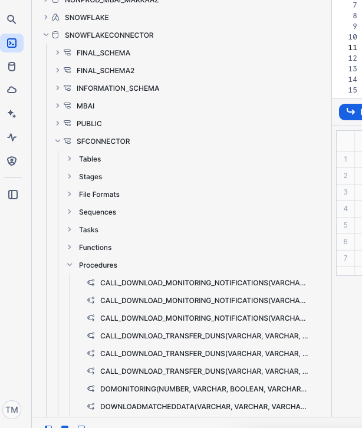

============
Introduction
============

The objective of this document is to provide a structured **user and implementation guide** for **Matchbook AI’s Snowflake Connector**, covering both **business users** and **IT administrators**. Connectors enable existing Snowflake customers to seamlessly integrate Matchbook AI’s cleanse, match, enrich, and monitor APIs into their environment. This empowers users to streamline data transformation and enrichment workflows without leaving their existing platform. 

1. **Guide Users in Data Management** – Help business users navigate Matchbook AI, manage source data, and download matched records. 

2. **Assist with Technical Implementation** – Provide IT teams with clear instructions on setting up, configuring, and optimizing Matchbook AI within Snowflake and Data Sharing. 

**Benefits**: 

* **Snowflake** can act as the **data ingestion point for D&B**, enabling advanced data cleansing, **real-time matching**, and enrichment without requiring users to switch between multiple tools or platforms. 

* Improves the efficiency of data pipelines, reduces **decision-making latency**, and **lowers the manual costs associated with data processing**. 

* Empowers customers to proactively manage their data to adapt to changes in business KPIs. 

* Enables **real-time monitoring** of data to ensure accuracy and relevance. 

* Eliminates issues related to inaccurate data, outdated information, and data silos. 

1. User Guide 
=============

This guide provides business users and IT administrators with a structured approach to integrating Matchbook AI’s cleanse, match, enrich, and monitor APIs within Snowflake. It helps business users navigate Matchbook AI, manage source data, and download matched records.  

1.1 Log in to Snowflake 
-----------------------

Navigate to your Snowflake account using the provided URL: https://app.snowflake.com/matchbook/dev/#/homepage  

.. figure:: images/1.png

1.2 Access Snowflake account for individual 
-------------------------------------------

Each user has unique login credentials. Log in using your assigned **username** and **password**.

.. figure:: images/2.png

Once logged in, you will be directed to the **Snowflake console dashboard**. 

1.3 Setting Up the Database and Schema
--------------------------------------

Creating Database and Schema 
^^^^^^^^^^^^^^^^^^^^^^^^^^^^

From the left side menu, go to '**Data**' and select '**Databases**', then click on '**+ Database**' to create a new one.

A pop-up window will appear. Enter a name for the database and a comment (optional), then click '**Create**'.  

Once the database is created, it will appear on the left-hand side. Click on the name of the database you created, then click on '**+ Schema**'. 

A pop-up window will appear. Enter the name for the schema and a comment (optional), then click '**Create**' to create the schema.

1.4 Creating Worksheets
-----------------------

Create Separate worksheet 
^^^^^^^^^^^^^^^^^^^^^^^^^

A separate worksheet should be created for each client to share their data and results. To create a worksheet, on the dashboard, select **Worksheets** and click on **Go to Worksheets**. 

(or) from the left-hand menu, select **Projects** -> **Worksheets**. 

You will be redirected to a new page, select **SQL Worksheet** from the drop-down menu.

Configuring Database and Schema
^^^^^^^^^^^^^^^^^^^^^^^^^^^^^^^

Once you select the SQL Worksheet, a new page opens.  

**Select the Role and Virtual Warehouse**:   

Click on the dot icon as shown in the screen below. 

As each worksheet can access only the allowed databases, select the **Role** and **Virtual Warehouse**, as shown below. 

**Use case**: Suppose a client wants to log in using the **DATAENGINEER** role and execute code with a **Medium** warehouse size. In this case, they should select the appropriate **Role** and **Virtual Warehouse** as demonstrated above.  

Role: DATAENGINEER 

Run on warehouse: DEVELOPER_MEDIUM 

**Select Database and Schema**: 

Select the database and schema by clicking on **No Database selected** drop-down menu as shown in the screen below.

**Note**: *Only the specified database and schema will have execution access unless explicit permissions are granted to other databases and schemas.*  

**Use case**: Select the database and schema as shown in the screen below. Here, SNOWFLAKE CONNECTOR is selected as database and SFCONNECTOR is selected as schema. 

**Note**: *Once the worksheet is created, it will appear on the dashboard.* 

Once the user opens a new worksheet and selects the appropriate database and schema, they need to execute the shared SQL scripts one by one. These scripts grant the necessary permissions required for the Snowflake app or the logged-in user to run the connector process.  

The first script to be executed is the **initialization script**.  

Running this script creates an egress network rule, which is needed to whitelist the MBAI server URL. 

It also creates the secret store table where the information required for calling MBAI APIs is stored. 

.. figure:: images/15.png

To create a table, click on the schema you created, then click on the '**Create**' dropdown menu.

From the menu, select '**Table**' and choose '**From File**'. 

Adding source data assets 
^^^^^^^^^^^^^^^^^^^^^^^^^

A pop-up window opens to select a warehouse. 

**Use case**: Here, DEVELOPER MEDIUM is selected. 

After selecting the warehouse, a pop-up window will appear. Import input data using **CSV** or **Excel** files by clicking on **Browse**. Select the database, schema, and table, and provide a name for the file you are uploading. Then, click '**Next**'.  

After clicking on **Next**, it takes few seconds to load data into table. Ensure all required columns are correctly populated with metadata. Click **Load** data to table to complete the process.

A success message is displayed after the data is loaded. 

**Note**:  

* *Clicking on 'Query Data' opens a new worksheet*. 

 * *Clicking on 'Done' closes the pop-up, and you can then create a worksheet from the dashboard*. 

After this, the remaining scripts should be executed one by one. It is recommended to create separate worksheets for each script to be executed. 

The table below includes the scripts. 

DROP TABLE IF EXISTS SNOWFLAKECONNECTOR.SFCONNECTOR.BUSINESS_ENTITIES_INPUTS_KULDIP; 
DROP TABLE IF EXISTS SNOWFLAKECONNECTOR.FINAL_SCHEMA.MATCH_MATCHOUTPUT_KULDIP; 
DROP TABLE IF EXISTS SNOWFLAKECONNECTOR.FINAL_SCHEMA.MATCH_ENRICHMENT_KULDIP; 
 DROP TABLE IF EXISTS SNOWFLAKECONNECTOR.FINAL_SCHEMA.STG_KULDIP; 

  

Call MATCHBOOK_MAINSCRIPT ('SNOWFLAKE_DEV','SFCONNECTOR','AAAA','FINAL_SCHEMA','MATCHOUTPUT_AAAA',50,'[SRC::Demo]'); 
call matchbook_enrichmentscript('SNOWFLAKE_DEV', 'FINAL_SCHEMA', 'MATCHOUTPUT_DB_147_TESTING_070401', 'FINAL_SCHEMA', 'ENRICHMENT_DB_147_TESTING_070401', 50, '["Firmographics"]'); 
call downloadmatcheddata('SNOWFLAKE_DEV','FINAL_SCHEMA','STG_KULDIP','FINAL_SCHEMA','MATCHOUTPUT_DB_147_TESTING_070401',10,'[SRC::Demo]'); 

  

Select * from "SNOWFLAKECONNECTOR"."FINAL_SCHEN"."SNOWFLAKE_DEV_MATCHOUTPUT_DB_147_TESTING_070401"; 

**Note**: If we need to re-import the worksheet or deploy a new version of the code, we use '*DROP TABLE*' and perform cleanup. 

* **CALL MATCHBOOK_MAINSCRIPT**: Runs the main Matchbook workflow to cleanse, match, and process your source data. 
 This is the primary script to kick off the end-to-end data pipeline. 

* **CALL MATCHBOOK_ENRICHMENTSCRIPT**: Enriches matched records with additional attributes like firmographics from D&B. 
 Use this after matching to add more context and value to your data. 

* **CALL DOWNLOADMATCHEDDATA**: Exports the final set of matched and enriched records from Snowflake. 
Use this to retrieve your processed data for reporting or downstream use.  

As the user runs these scripts, they trigger specific stored procedures and functions that Snowflake uses to connect to the MBAI server and retrieve the required data for various tasks.

Here is an example of how it looks: 

**Procedures**: 

**Functions**:

Inside the stage folder, the supporting Python scripts need to be imported. These scripts contain supporting functions for calling the MBAI APIs. They are used within the procedures and functions defined in the SQL scripts.

1.5 Deploying Scripts and Sharing Data in Snowflake
---------------------------------------------------
 
**Script Deployment** 

1. Deploy all three scripts in the Snowflake environment using the correct **Role**, **Database**, and **Schema** as shown. 

2. Run the procedure in your worksheet. Once successfully created, a confirmation message will appear in the **Snowflake message box**. 

**Data Sharing Process** 

1. User Data Sharing 

 a. Users share **sample data**, identified by a **client ID** (e.g., MBQA1). 

 b. Data is available within a **specific schema**, allowing users to share either the **schema** or **table**. 

2. Granting Access 

 a. Perform the **grant share** action to provide access to the recipient. 

 b. Verify the recipient and confirm that **Matchbook AI** has access to the shared data. 

3. Process Establishment 

 a. Customer Responsibilities: Follow the outlined steps to share data via **Delta Sharing**. 

 b. Our Responsibilities: Configure processes and setups based on the shared data. 

4. Process Configuration 

 a. Job Creation: Set up scripts for **cleanse, match, classify, enrich, and refresh**. 

 b. Configure **job settings** and **parameters** accordingly. 

 c. Start by configuring the **share name** in the **Cleanse Match** job. 

**Note**: This sharing process is manual. Our system will automatically generate a **Database** linked to your **client ID**, ensuring seamless access. Each client will have a unique identifier. 

**Viewing Shared Tables** 

To view the tables shared with you, follow these steps: 

1.5.1 Managing the key vault
^^^^^^^^^^^^^^^^^^^^^^^^^^^^

* Snowflake does not support adding secrets through a standard user account. Instead, secrets must be managed by an **authorized user**. 

* Secrets can be organized within a **secret store**, where each store is dedicated to a specific client. For example, we establish **client-specific scopes** to manage API keys and secrets securely. 

* To demonstrate, we can **list the secrets** within a secret store by specifying the **client's name** as the secret store. Within this store, we can manage and update various credentials, such as **tokens, API keys, and other sensitive data**. 

1.5.2 Managing Auth token
^^^^^^^^^^^^^^^^^^^^^^^^^

* The authentication token is used to **automate specific processes**, such as triggering the **enrichment data process**. To achieve this, we make calls to the **Snowflake REST API**. 

* This token is **generated directly from Snowflake** and is specific to the **Snowflake database**, not our own system. It is solely used to **authenticate and trigger Snowflake API calls** for process execution. 

1.5.3 Retrieving the Token for the Client 
^^^^^^^^^^^^^^^^^^^^^^^^^^^^^^^^^^^^^^^^^

Each script **generates a token at the beginning**, which is then **used throughout the execution** to avoid multiple token generations. A **new token is only created if the existing one expires**, ensuring efficient token management and reducing unnecessary requests. Once processed, the **output table will contain new records**, and the **next script will trigger automatically**.  

1.5.4 Process Enrichment Data 
^^^^^^^^^^^^^^^^^^^^^^^^^^^^^

A Python script is created for each client, integrating essential values such as **MB_QA1, API keys**, and secrets for initial setup. This script automates the generation of required components, allowing clients to set up jobs while enabling direct REST API calls, eliminating manual intervention.

**Enrichment Classes Optimization** 

Optimizing enrichment classes by improving stage table performance and centralizing parameters for streamlined management. 

* **Stage Table Optimization**- Enhance the structure and performance of the stage table. 

* **Centralized Parameters**- Consolidate and organize all parameters in a single location for efficient management. 

*Optimization*
"""""""""""""""""

To improve efficiency, the process focuses on enhancing the stage table's structure and performance, centralizing parameters for better management, and implementing input merge updates to streamline data handling.  

* Enhance the structure and performance of the stage table. 

* Centralize all parameters for better management. 

* Implement input merge updates for efficiency.

*Run Jobs*
""""""""""""

Go to the **Procedure** tab within the schema and select the **Enrichment** script. 

*Running the Cleansematch Process* 
""""""""""""""""""""""""""""""""""""

The Cleansematch process is a crucial first step in data processing. It involves executing the script with the required arguments, validating configurations, and managing the Database and tables.  

Initial Setup 
~~~~~~~~~~~~~

* The **Cleansematch** process is mandatory and should be run first. 

* Execute the script with the required arguments. 

Configuration and Validation 
~~~~~~~~~~~~~~~~~~~~~~~~~~~~

* Verify that **batch_size** is between 1 and 50; otherwise, an error will be thrown. 

* Validate the **delta_sharing_mode** configuration parameter. 

* Ensure the **share name** matches the **client_id**. 

Database and Table Management 
~~~~~~~~~~~~~~~~~~~~~~~~~~~~~

* If the **Database** does not exist, it will be created automatically. 

* If the **destination_table** is unavailable, clone the **source_table** and add a **Status** column, defaulting to **NEW**. 

*Process Enrichment Data*
""""""""""""""""""""""""""

If the delta_sharing_mode configuration parameter is provided, the system validates the provider using the delta_sharing_identifier. If a valid provider is not found, an error is thrown. When clients share data via delta sharing, they must ensure that the share name matches the client_id, as this is essential for identifying the correct share when multiple clients are involved. If there is a mismatch, an error will be triggered. Once the share is successfully identified, the system will automatically create the Database if it does not already exist.   

If the **destination_table** (where the match output result will be stored) is not available: 

* Clone the **source table**. 

* Add a new column called **Status** and set its value to **NEW**. 

* Set **NEW** as the default value so that all newly inserted records have this status. 

If the **destination_table** is available: 

* Sync the **source_table** and **destination_table** using the primary key provided by the user. Match records and add any that do not exist in the destination_table. 

* Sync records with ERROR status that have been updated in the source_table, update them in the destination_table, and set their status to NEW for reprocessing. 

* During the syncing process, save the current UTC timestamp in the table as a checkpoint for future synchronization of records with ERROR status. 

For all records in the destination_table: 

If a record is NEW and Tags is NULL or EMPTY, update Tags to NULL if it is EMPTY. 

If the Tags parameter is provided, update records with the provided value in Tags. 

If a record is not processed (Processed = False), it will be considered for CleanseMatch processing. 

 

We will call the MatchEnrich API based on the batch_size value, processing data in chunks with parallelism determined by batch_size. After each chunk is processed, the results will be updated in the destination_table. At the end of the process, the Process Enrichment Data job will be triggered automatically, but only if there is data to be processed.